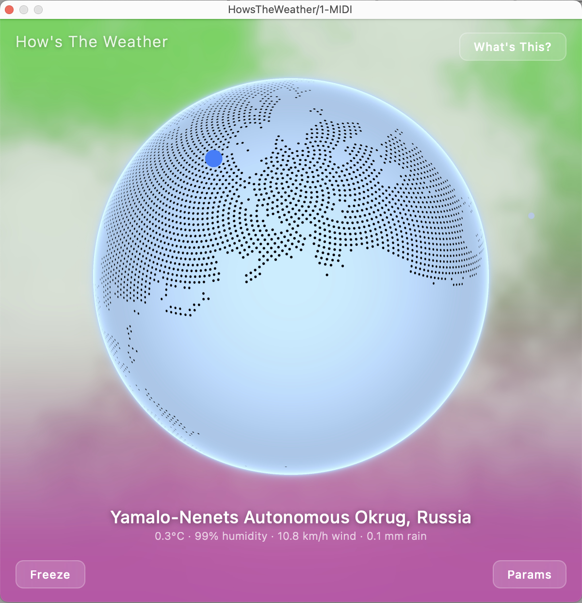
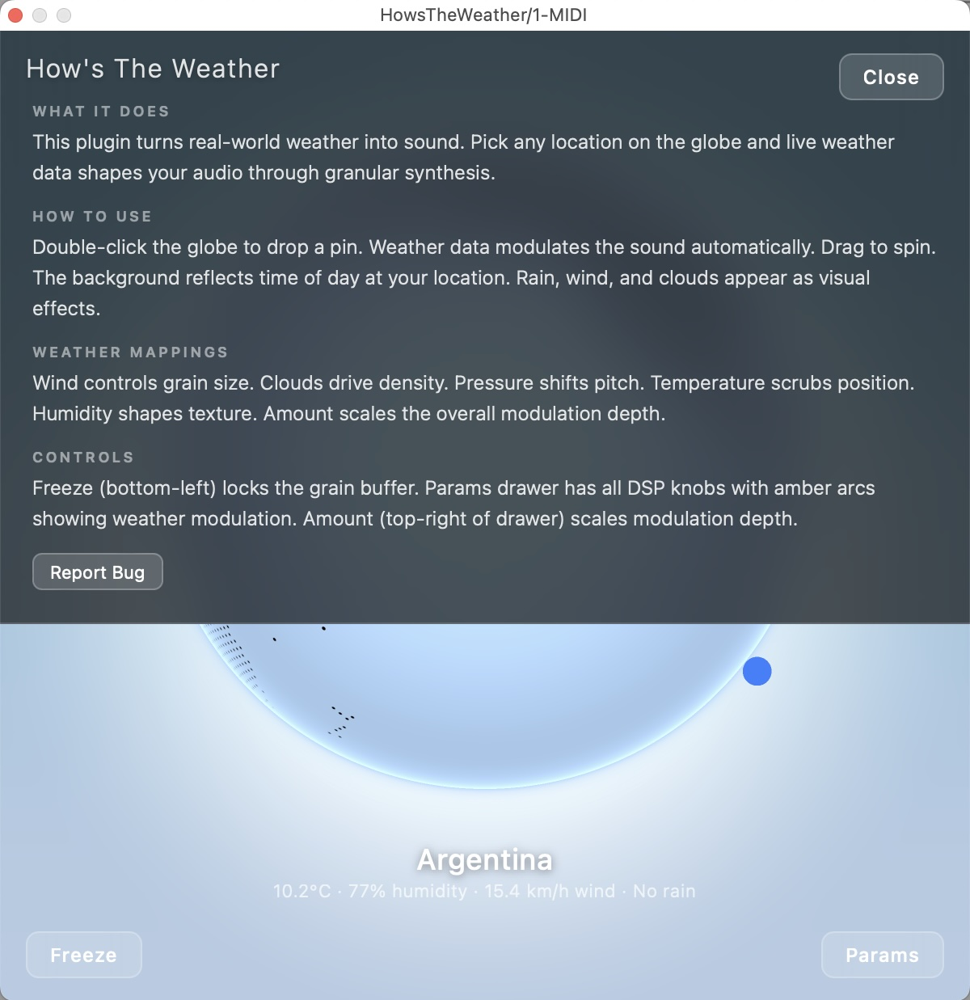
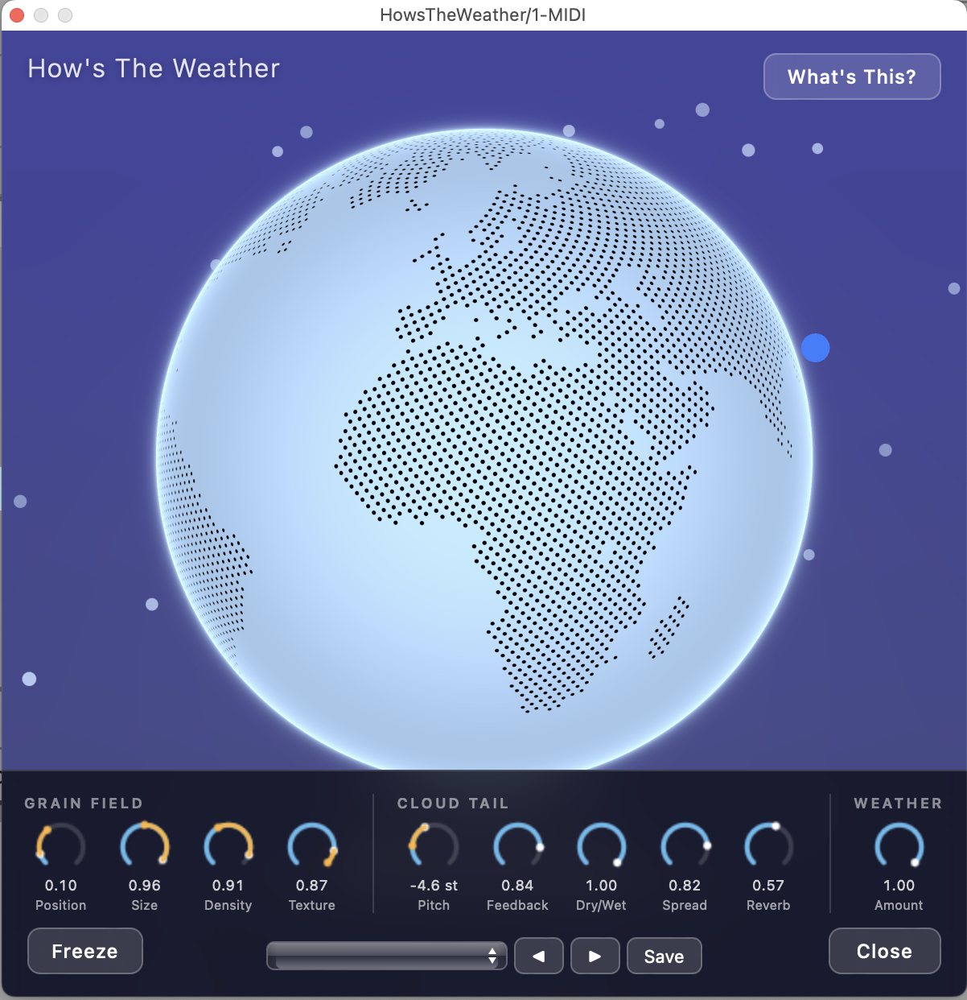

# How's The Weather



A granular audio effect plugin that listens to the real world. Live weather data — wind, clouds, pressure, temperature, humidity — modulates the granular engine in real time, turning your audio into a slowly-evolving response to whatever the sky is doing outside.

## Inspiration

In 1821, John Constable spent the summer on Hampstead Heath painting nothing but skies — around 100 plein-air oil studies, each inscribed on the back with the date, time, and wind direction. 

That story is the seed of this plugin. What if Constable's cloud studies could be turned into a sound generator? Take real-time atmospheric data (the same wind, light, and pressure he was watching), feed it into the **Mutable Instruments Clouds**-style granular engine, wrap the whole thing in an interactive globe UI — and your audio becomes a granular response to whatever the sky is doing, right now, anywhere on Earth.

Constable provided the conceptual frame. Clouds provided the granular voice. Open-Meteo provides the live weather. HowsTheWeather is what falls out when you bolt them together.

## How It Works

Audio flows through a circular buffer, gets sliced into 32 simultaneous grains, and recombines through diffusion, FDN reverb, and an equal-power dry/wet crossfade — classic Clouds-style granular processing.

When weather mode is on, real-time data fetched from your chosen latitude/longitude (every 5 minutes, slew-interpolated for smoothness) adds bipolar offsets to five knobs:

| Weather | Modulates | Range |
|---|---|---|
| Pressure  | Pitch    | ±12 semitones |
| Temperature | Position | ±0.6 |
| Wind speed | Grain size | ±0.6 |
| Cloud cover | Density | ±0.6 |
| Humidity | Texture | ±0.6 |

Offsets are additive — your knob position is never overwritten, weather just nudges it. Feedback, dry/wet, spread, reverb, and freeze stay entirely under your control.



## Features

- **Granular engine**: 32 simultaneous grains, per-grain position / size / pitch / window / stereo spread
- **Pitch shifting**: ±24 semitones
- **Freeze**: stops buffer writing, loops the captured content indefinitely
- **Post-grain diffusion** (texture-driven) and **FDN reverb** (Clouds-style)
- **Weather modulation** with independent toggles for DSP routing and GUI visuals
- **Live WebView GUI** with optional weather-driven background gradient and wind particles
- **6 factory presets**: Default, Ambient Drift, Weather Storm, Frozen Clouds, Gentle Rain, Shimmer Breeze



## System Requirements

- **macOS** 10.13 or later (Intel and Apple Silicon)
- An **AU**, **VST3** host, or run the **Standalone** app
- ~100 MB disk

Internet connection required *only* if you want live weather modulation; the plugin runs fine offline (weather offsets stay neutral).

## Installation

### Download

Grab `HowsTheWeather-v1.4.15-macOS.zip` from `Release/` (or the [Releases page](../../releases)). Unzip.

### Install the bundles

| Format | Drag this | Into this folder |
|---|---|---|
| AU | `AU/HowsTheWeather.component` | `~/Library/Audio/Plug-Ins/Components/` |
| VST3 | `VST3/HowsTheWeather.vst3` | `~/Library/Audio/Plug-Ins/VST3/` |
| Standalone | `Standalone/HowsTheWeather.app` | `/Applications/` (or anywhere) |

### First launch (Gatekeeper)

The bundles aren't code-signed yet, so macOS will block them on first open. Two options:

**Easy way:** Right-click the bundle → Open → confirm "Open" in the dialog. macOS remembers your approval.

**Terminal way:**
```bash
xattr -d com.apple.quarantine ~/Library/Audio/Plug-Ins/VST3/HowsTheWeather.vst3
xattr -d com.apple.quarantine ~/Library/Audio/Plug-Ins/Components/HowsTheWeather.component
xattr -d com.apple.quarantine /Applications/HowsTheWeather.app
```

Restart your DAW and rescan plugins.

## Build From Source

Requires CMake 3.22+, Ninja, Xcode command-line tools, and [JUCE](https://github.com/juce-framework/JUCE) at `/Applications/JUCE` (adjust `CMakeLists.txt` if elsewhere).

```bash
git clone https://github.com/fr4nky8oy/HowsTheWeather.git
cd HowsTheWeather
cmake -B build -G Ninja -DCMAKE_BUILD_TYPE=Release
cmake --build build
```

`COPY_PLUGIN_AFTER_BUILD` is on by default — the build will install the AU and VST3 to `~/Library/Audio/Plug-Ins/` automatically.

## Changelog

See [CHANGELOG.md](CHANGELOG.md) for the full release history.

## License

MIT — see [LICENSE](LICENSE).
